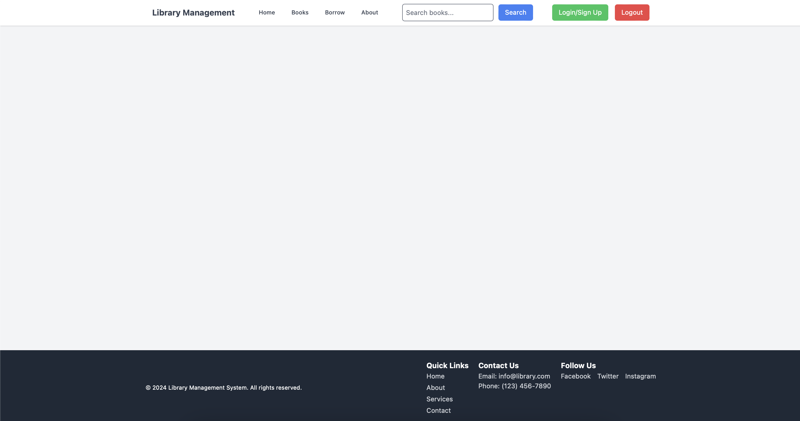
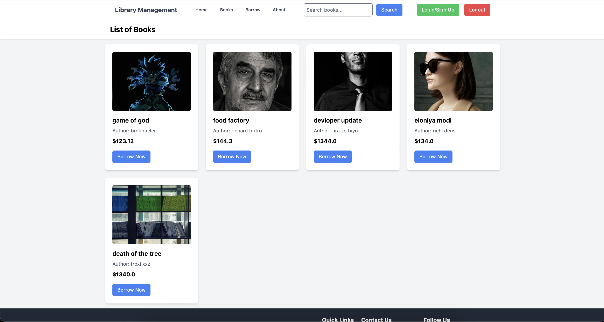
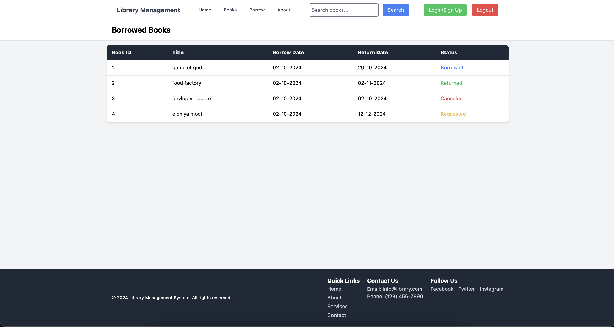
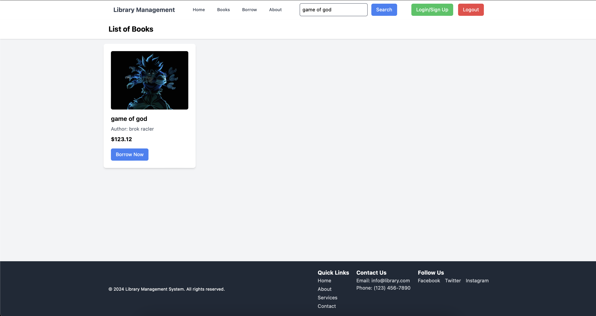

---

# Library Management System

This is a simple web-based Library Management System built using Django and Tailwind CSS. It provides a platform to manage books in a library, including functionalities to add, edit, and delete books, along with features for users to view the available books.



## Features

- **Book Management**: Add, edit, view, and delete books.
- **Book List & Details**: Display all books with details such as author, title, and availability.
- **User-Friendly Interface**: Clean and minimal UI powered by Tailwind CSS.
- **Responsive Design**: The layout adjusts to various screen sizes for better usability on mobile devices.
- **Efficient Search**: Search books by title or author.







## Installation

1. Clone the repository:

   ```bash
   git clone https://github.com/mohitnandaniya31/Library_Management.git
   cd Library_Management
   ```

2. Create a virtual environment and activate it:

   ```bash
   python -m venv venv
   source venv/bin/activate  # On Windows use `venv\Scripts\activate`
   ```

3. Install the dependencies:

   ```bash
   pip install -r requirements.txt
   ```

4. Apply migrations:

   ```bash
   python manage.py migrate
   ```

5. Create a superuser to access the Django admin panel:

   ```bash
   python manage.py createsuperuser
   ```

6. Run the development server:

   ```bash
   python manage.py runserver
   ```

7. Access the application at `http://127.0.0.1:8000/`.

## Usage

- Navigate to the home page to view the list of books.
- Admins can log in to add new books or edit existing ones.
- Search for books by title or author in the search bar.

## Technologies Used

- **Backend**: Django
- **Frontend**: Tailwind CSS
- **Database**: SQLite (default for Django)

## Contribution

If you would like to contribute, feel free to fork the repository and submit a pull request. You can also open issues for bugs or feature requests.

## License

This project is licensed under the MIT License.

---
